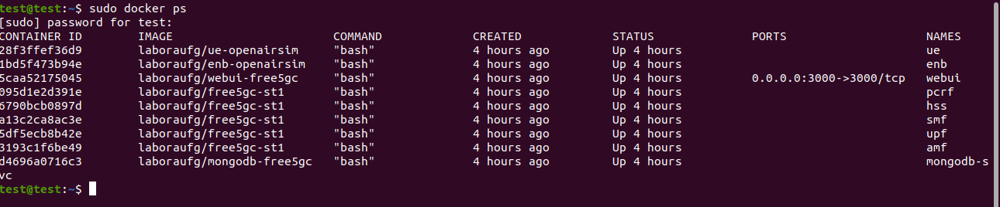
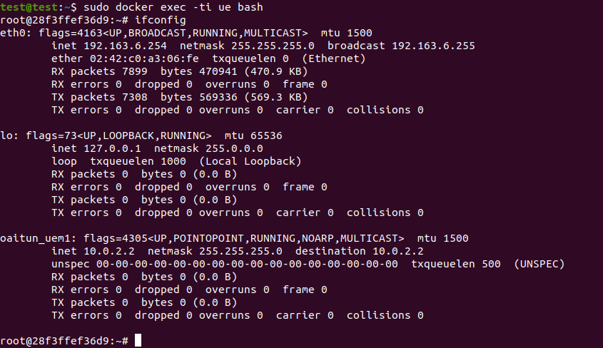

# Using Docker to deploy the 5G network

- [Installation](#installation)
- [Configuration steps](#configuration-steps)


### Installation
The installation can be done directly over the host operating system (OS) or inside a virtual machine (VM).   

**System requirements**
- CPU type: x86-64 (specific model and number of cores only affect performance)
- RAM: 4 GB
- Disk space: 40 GB
- Ubuntu 18.04 LTS


**Steps**  
**1. Install python 2.7:**      
    
``` sudo apt update && apt -y install python ```    
     
        
**2. Install git :**    
  
  ``` sudo apt -y install git ```     
     
**3. Clone this repository:**   
  
    
  ``` git clone add link for the docker ``` 
    

**4. Clone this repository:**   
  
``` sudo apt -y install ansible ```   
  
    
**5. to go docker-file** 
  
``` cd folder name ```     
  
**6. Run ansible-play book to deploy 5G network**  
   
``` ansible-playbook -K our-doker.yml  -e  "internet_network_interface=<< internet network interface name>>" ```    
   
**7. Test Installation**   
    
``` sudo docker ps ```   
  
  
  
  
**8. Test Web interface**   
    
``` http://0.0.0.0:3000 ```  
  
  User name : admin  
  Password :1423   
  
     
  
     

  
   
**9. Test UE access**   
   
   ``` docker exec -ti ue bash  ```  
    
    to check UE ip address run:  
    ``` ifconfig  ```  
     
   
     and then   
       
    ``` ping google.com  ```  
    


     
    
        
